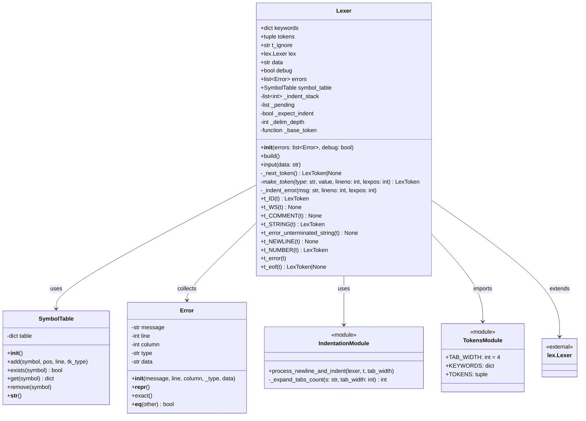
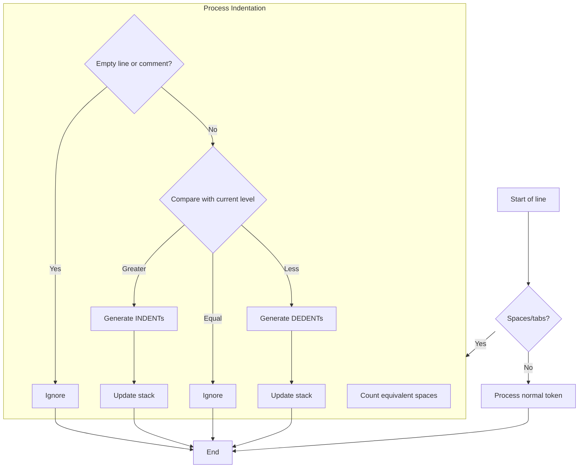
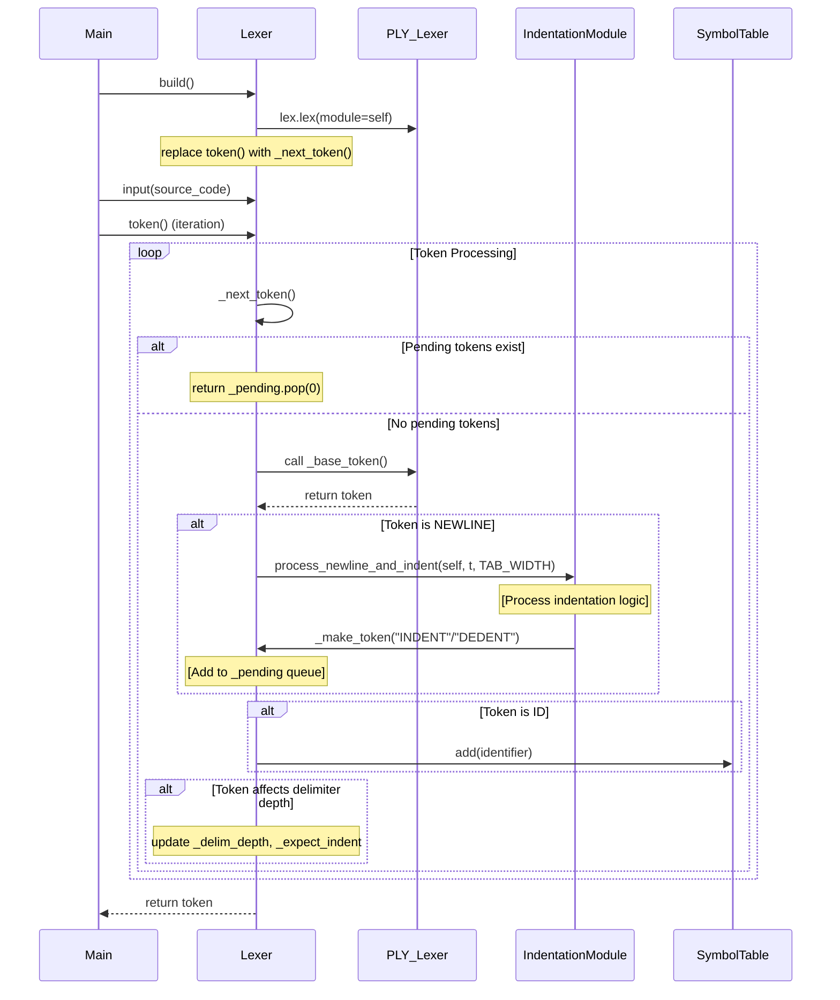

# Lexer Design

## Class Diagram

```mermaid
classDiagram
    class Lexer {
        +dict keywords
        +tuple tokens
        +str t_ignore
        +lex.Lexer lex
        +str data
        +bool debug
        +list~Error~ errors
        +SymbolTable symbol_table
        -list~int~ _indent_stack
        -list _pending
        -bool _expect_indent
        -int _delim_depth
        -function _base_token

        +__init__(errors: list~Error~, debug: bool)
        +build()
        +input(data: str)
        -_next_token() LexToken|None
        -_make_token(type_: str, value, lineno: int, lexpos: int) LexToken
        -_indent_error(msg: str, lineno: int, lexpos: int)
        +t_ID(t) LexToken
        +t_WS(t) None
        +t_COMMENT(t) None
        +t_STRING(t) LexToken
        +t_error_unterminated_string(t) None
        +t_NEWLINE(t) None
        +t_NUMBER(t) LexToken
        +t_error(t)
        +t_eof(t) LexToken|None
    }

    class SymbolTable {
        -dict table

        +__init__()
        +add(symbol, pos, line, tk_type)
        +exists(symbol) bool
        +get(symbol) dict
        +remove(symbol)
        +__str__()
    }

    class Error {
        -str message
        -int line
        -int column
        -str type
        -str data

        +__init__(message, line, column, _type, data)
        +__repr__()
        +exact()
        +__eq__(other) bool
    }

    class IndentationModule {
        <<module>>

        +process_newline_and_indent(lexer, t, tab_width)
        -_expand_tabs_count(s: str, tab_width: int) int
    }

    class TokensModule {
        <<module>>

        +TAB_WIDTH: int = 4
        +KEYWORDS: dict
        +TOKENS: tuple
    }

    class lex.Lexer {
        <<external>>
    }

    Lexer --> SymbolTable : uses
    Lexer --> Error : collects
    Lexer --> IndentationModule : uses
    Lexer --> TokensModule : imports
    Lexer --> lex.Lexer : extends
```

## Flow Diagram

```mermaid
flowchart TD
    A[Start of line] --> B{Spaces/tabs?}
    B -->|Yes| C[process_indent_dedent]
    B -->|No| D[Process normal token]
    subgraph C [Process Indentation]
        C1[Count equivalent spaces]
        C2{Empty line or comment?}
        C2 -->|Yes| C3[Ignore]
        C2 -->|No| C4{Compare with current level}
        C4 -->|Greater| C5[Generate INDENTs]
        C4 -->|Equal| C6[Ignore]
        C4 -->|Less| C7[Generate DEDENTs]
        C5 --> C8[Update stack]
        C7 --> C9[Update stack]
    end
    C3 --> E[End]
    C6 --> E
    C8 --> E
    C9 --> E
    D --> E
```

## Sequence Diagram

```mermaid
sequenceDiagram
    participant Main
    participant Lexer
    participant PLY_Lexer
    participant IndentationModule
    participant SymbolTable

    Main->>Lexer: build()
    Lexer->>PLY_Lexer: lex.lex(module=self)
    Note over Lexer: replace token() with _next_token()

    Main->>Lexer: input(source_code)
    Main->>Lexer: token() (iteration)

    loop Token Processing
        Lexer->>Lexer: _next_token()

        alt Pending tokens exist
            Note over Lexer: return _pending.pop(0)
        else No pending tokens
            Lexer->>PLY_Lexer: call _base_token()
            PLY_Lexer-->>Lexer: return token

            alt Token is NEWLINE
                Lexer->>IndentationModule: process_newline_and_indent(self, t, TAB_WIDTH)
                Note over IndentationModule: [Process indentation logic]
                IndentationModule->>Lexer: _make_token("INDENT"/"DEDENT")
                Note over Lexer: [Add to _pending queue]
            end

            alt Token is ID
                Lexer->>SymbolTable: add(identifier)
            end

            alt Token affects delimiter depth
                Note over Lexer: update _delim_depth, _expect_indent
            end
        end
    end

    Lexer-->>Main: return token
```
