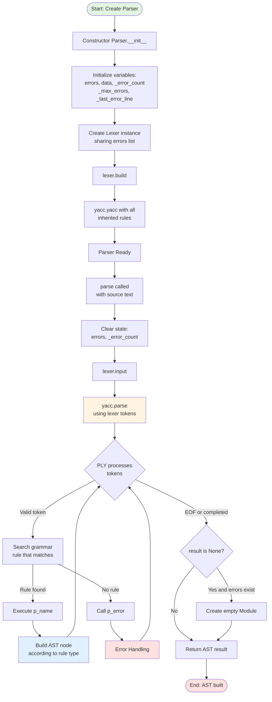
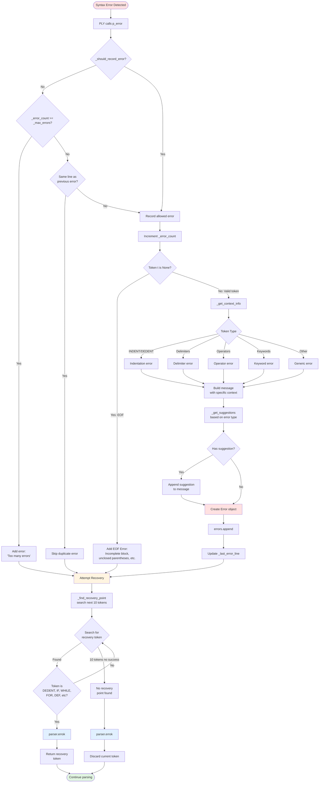

# Parser Design

## General Parser Flow

```mermaid
flowchart TD
    Start([Start: Create Parser]) --> Init[Constructor Parser.__init__]
    Init --> SetupVars[Initialize variables:<br/>errors, data, _error_count<br/>_max_errors, _last_error_line]
    SetupVars --> CreateLexer[Create Lexer instance<br/>sharing errors list]
    CreateLexer --> BuildLexer[lexer.build]
    BuildLexer --> BuildParser[yacc.yacc with all<br/>inherited rules]
    BuildParser --> ParserReady[Parser Ready]

    ParserReady --> ParseCall[parse called<br/>with source text]
    ParseCall --> ClearState[Clear state:<br/>errors, _error_count]
    ClearState --> LexerInput[lexer.input]
    LexerInput --> YaccParse[yacc.parse<br/>using lexer tokens]

    YaccParse --> TokenLoop{PLY processes<br/>tokens}
    TokenLoop -->|Valid token| MatchRule[Search grammar<br/>rule that matches]

    MatchRule -->|Rule found| ExecuteRule[Execute p_name]
    ExecuteRule --> BuildAST[Build AST node<br/>according to rule type]
    BuildAST --> TokenLoop

    MatchRule -->|No rule| CallError[Call p_error]
    CallError --> ErrorHandling[Error Handling]
    ErrorHandling --> TokenLoop

    TokenLoop -->|EOF or completed| CheckResult{result is None?}
    CheckResult -->|Yes and errors exist| CreateEmptyModule[Create empty Module]
    CheckResult -->|No| ReturnResult[Return AST result]
    CreateEmptyModule --> ReturnResult

    ReturnResult --> End([End: AST built])

    style Start fill:#e1f5e1
    style End fill:#ffe1e1
    style YaccParse fill:#fff4e1
    style ErrorHandling fill:#ffe1e1
    style BuildAST fill:#e1f0ff
```

## Error Handling Flow

```mermaid
flowchart TD
    Start([Syntax Error Detected]) --> PErrorCall[PLY calls p_error]
    PErrorCall --> CheckRecord{_should_record_error?}

    CheckRecord -->|No| CheckMaxErrors{_error_count >= _max_errors?}
    CheckMaxErrors -->|Yes| AddMaxError[Add error:<br/>'Too many errors']
    CheckMaxErrors -->|No| CheckSameLine{Same line as<br/>previous error?}
    CheckSameLine -->|Yes| SkipError[Skip duplicate error]
    CheckSameLine -->|No| RecordError

    CheckRecord -->|Yes| RecordError[Record allowed error]
    RecordError --> IncCounter[Increment _error_count]
    IncCounter --> CheckToken{Token t is None?}

    CheckToken -->|Yes: EOF| AddEOFError[Add EOF Error:<br/>Incomplete block,<br/>unclosed parentheses, etc.]
    CheckToken -->|No: Valid token| GetContext[_get_context_info]

    GetContext --> ContextSwitch{Token Type}
    ContextSwitch -->|INDENT/DEDENT| IndentError[Indentation error]
    ContextSwitch -->|Delimiters| DelimError[Delimiter error]
    ContextSwitch -->|Operators| OpError[Operator error]
    ContextSwitch -->|Keywords| KeywordError[Keyword error]
    ContextSwitch -->|Other| GenericError[Generic error]

    IndentError --> BuildMessage[Build message<br/>with specific context]
    DelimError --> BuildMessage
    OpError --> BuildMessage
    KeywordError --> BuildMessage
    GenericError --> BuildMessage

    BuildMessage --> GetSuggestions[_get_suggestions<br/>based on error type]
    GetSuggestions --> AppendSuggestion{Has suggestion?}
    AppendSuggestion -->|Yes| AddSuggestion[Append suggestion<br/>to message]
    AppendSuggestion -->|No| CreateError
    AddSuggestion --> CreateError[Create Error object]

    CreateError --> AppendError[errors.append]
    AppendError --> UpdateLine[Update _last_error_line]

    AddEOFError --> Recovery
    SkipError --> Recovery
    AddMaxError --> Recovery
    UpdateLine --> Recovery[Attempt Recovery]

    Recovery --> FindRecovery[_find_recovery_point<br/>search next 10 tokens]
    FindRecovery --> SearchTokens{Search for<br/>recovery token}

    SearchTokens -->|Found| TokenFound{Token is<br/>DEDENT, IF, WHILE,<br/>FOR, DEF, etc?}
    TokenFound -->|Yes| CallErrok[parser.errok]
    CallErrok --> ReturnToken[Return recovery<br/>token]

    TokenFound -->|No| SearchTokens
    SearchTokens -->|10 tokens no success| NoRecovery[No recovery<br/>point found]
    NoRecovery --> CallErrok2[parser.errok]
    CallErrok2 --> DiscardToken[Discard current token]

    ReturnToken --> End([Continue parsing])
    DiscardToken --> End

    style Start fill:#ffe1e1
    style End fill:#e1f5e1
    style Recovery fill:#fff4e1
    style CreateError fill:#ffe1e1
    style CallErrok fill:#e1f0ff
    style CallErrok2 fill:#e1f0ff
```
